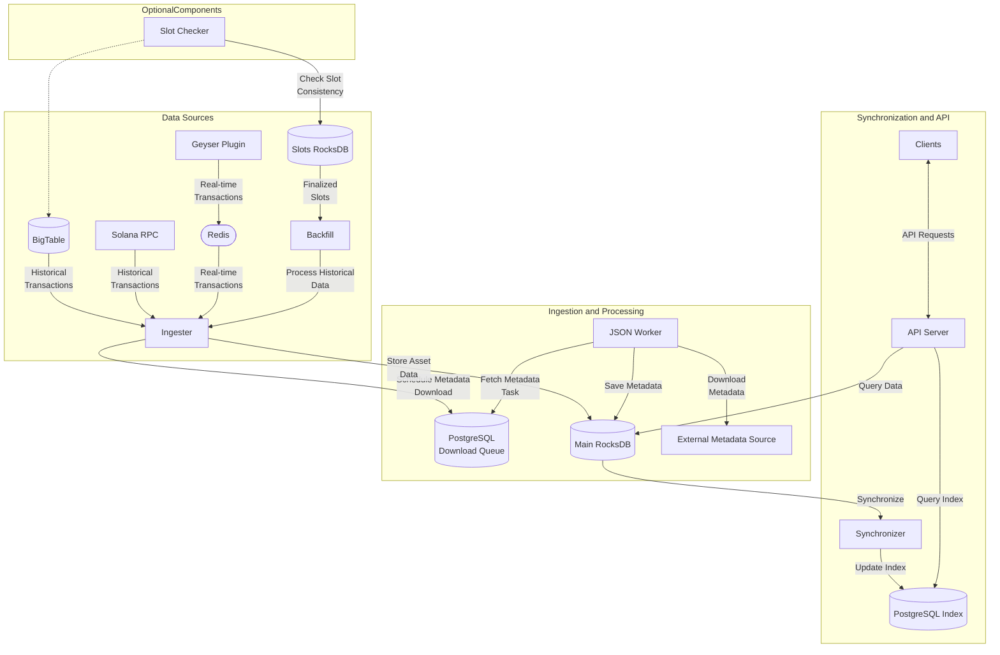

**For a high-level overview and introduction to the project, please see the [README](../README.md).**

# System Architecture Overview

This document describes the architecture of the `nft_ingester` project, outlining its components, their responsibilities, data flow, and database interactions.

## Design Principles

The system is designed with the following principles in mind:

*   **Scalability**: Components are designed to handle large volumes of data and high transaction throughput.
*   **Maintainability**: Clear separation of concerns between components, well-defined interfaces, and extensive use of logging and metrics.
*   **Data Consistency**:  Robust mechanisms for ensuring data integrity, including validation against finalized data sources and gap filling.
*   **Performance**:  Optimized for both write-heavy ingestion and read-heavy API access, leveraging both RocksDB and PostgreSQL.
*   **Extensibility**:  Modular design allows for future additions and modifications, such as the potential separation of metadata into its own database.

## Binary Components

The system is composed of several specialized binaries, each performing a specific role in processing and managing NFT data from the Solana blockchain. The system is heavily asynchronous, leveraging `tokio` for concurrency.

### Primary Services

1.  **`ingester`** (`nft_ingester/src/bin/ingester/main.rs`):
    *   **Responsibilities**:
        *   The core of the system, responsible for real-time ingestion of NFT data from the Solana blockchain.
        *   Processes account updates and token transfers, handling both confirmed and finalized data.
        *   Writes data to the main RocksDB database.
        *   Integrates multiple sub-components:
            *   API server (similar to the standalone `api` binary, but integrated for performance).
            *   Backfill (for historical data).
            *   Gap filler (to handle missing data).
            *   Sequence consistent checker (ensures data integrity).
            *   Redis workers (for asynchronous processing of account and transaction data).
        *   Manages connections to Redis, RocksDB, and PostgreSQL.
        *   Handles graceful shutdown and metrics reporting.
        *   Performs signature fetching for finalized data validation (critical for Bubblegum tree consistency).
    *   **Key Dependencies**: RocksDB, PostgreSQL, Redis.

2.  **`synchronizer`** (`nft_ingester/src/bin/synchronizer/main.rs`):
    *   **Responsibilities**:
        *   Ensures data consistency between RocksDB (the primary data store) and PostgreSQL (the indexed, queryable store).
        *   Performs a full synchronization of data, handling different asset types.
        *   Uses a configurable batch size and parallel tasks for efficient data transfer.
    *   **Key Dependencies**: RocksDB, PostgreSQL.

3.  **`slot_persister`** (`nft_ingester/src/bin/slot_persister/main.rs`):
    *   **Responsibilities**:
        *   Fetches and persists finalized slot data to the slots RocksDB database.
        *   Provides a reliable source of finalized data for backfilling and validation.
        *   Can fetch data from either BigTable (optional) or an RPC source.
        *   Handles retries and error handling, ensuring the slots data is consistent and sequential - that is the slot number is always increasing and never skipped (although it still may miss some slots due to the eventual consistency of bigtable).
    *   **Key Dependencies**: RocksDB, BigTable (optional), Solana RPC.

4.  **`backfill`** (`nft_ingester/src/bin/backfill/main.rs`):
    *   **Responsibilities**:
        *   Handles backfilling of historical blockchain data from the slots database, ensuring complete data coverage.
        *   Fetches and processes historical transaction data from the Slots RocksDB.
        *   Parses transaction data to extract Bubblegum NFT-related operations.
        *   Uses `DirectBlockParser` and `BubblegumTxProcessor` for specific transaction types.
        *   Writes processed data to the main RocksDB database.
        *   Provides progress tracking.
    *   **Key Dependencies**: RocksDB, Solana RPC.

### Utility Services

5.  **`api`** (`nft_ingester/src/bin/api/main.rs`):
    *   **Responsibilities**:
        *   Provides RPC API for querying NFT data.
        *   Queries both RocksDB and PostgreSQL databases.
        *   Optionally performs checks for gaps in Merkle tree sequences.
        *   Uses a `JsonWorker` to handle JSON metadata fetching and refreshing.
    *   **Current Status**:  While functional, it's less actively used than the integrated API within the `ingester` due to performance considerations with secondary RocksDB instances.  Future optimization is planned.
    *   **Key Dependencies**: RocksDB, PostgreSQL, Redis.

6.  **`explorer`** (`nft_ingester/src/bin/explorer/main.rs`):
    *   **Responsibilities**:
        *   Provides a RESTful service for exploring the RocksDB data directly.
        *   Allows iteration over keys and retrieval of values within specific RocksDB column families.
        *   Useful for debugging and data inspection.
    *   **Key Dependencies**: `rocksdb::DB`, `axum`, `metrics_utils`.
    *   **Key Dependencies**: RocksDB.

7.  **`migrator`** (`nft_ingester/src/bin/migrator/main.rs`):
    *   **Responsibilities**:
        *   Handles JSON metadata keys migration from RocksDB to PostgreSQL.
        *   Supports "full" (migrate JSONs and set tasks) and "jsons only" modes.
        *   Is a one-time tool to migrate the data from RocksDB to PostgreSQL.
    *   **Key Dependencies**: RocksDB, PostgreSQL.

8.  **`rocksdb_backup`** (`nft_ingester/src/bin/rocksdb_backup/main.rs`):
    *   **Responsibilities**:
        *   Creates backups of the RocksDB database.
        *   Configurable backup and archive directories.
        *   Option to flush RocksDB before backup.
    *   **Key Dependencies**: RocksDB.

9.  **`raw_backup`** (`nft_ingester/src/bin/raw_backup/main.rs`):
    *   **Responsibilities**:
        *   **(Deprecated)** Creates a raw backup of the RocksDB `OffChainData` column family.
    *   **Key Dependencies**: RocksDB.

10.  **`slot_checker`** (`nft_ingester/src/bin/slot_checker/main.rs`):
    *   **Responsibilities**:
        *   Verifies the consistency of slot data between RocksDB and BigTable (if used) or RPC source.
        *   Identifies missing slots.
    *   **Key Dependencies**: RocksDB, BigTable (optional), Solana RPC.

11.  **`synchronizer_utils`** (`nft_ingester/src/bin/synchronizer_utils/main.rs`):
    *   **Responsibilities**:
        *   Provides utilities for working with the synchronizer, allowing querying of asset indexes.
        *   Useful for debugging and data inspection.
    *   **Key Dependencies**: RocksDB, PostgreSQL.
    
12.  **`dumper`** (`nft_ingester/src/bin/dumper/main.rs`):
     *   **Responsibilities**:
         *   Exports data from RocksDB to CSV files in the same manner as the synchronizer will do for a full sync.
         *   Iterates through RocksDB data (creators, assets, authorities, etc.).
         *   Writes the data to separate CSV files, potentially sharding the output for large datasets.
         *   Dumps last known keys for tracking progress.
     *   **Key Dependencies**: RocksDB, PostgreSQL, Redis.

## Data Sources and Flow

### Data Sources

1.  **Finalized Data Sources**:
    *   **Slots Database (RocksDB)**: Contains only finalized slot data. Used for backfilling and data validation.
    *   **Data Origin**:  The Slots DB can be populated from either BigTable or a Solana RPC node.
    *   **Signature Fetching (Integrated in `ingester`)**: Fetches and validates transaction signatures, crucial for Bubblegum tree consistency and resolving fork-related issues.  Signatures can be fetched from either BigTable or a Solana RPC node.

2.  **Non-Finalized Data Source**:
    *   **Redis**: Receives real-time account and transaction updates from the Geyser plugin via a Redis queue.

### Data Flow and Processing

This section describes the main data flow and processing steps within the system.

**Data Preparation:**

1.  **Real-time Data:** The `ingester` receives real-time transaction data from the Geyser plugin via Redis. It also has the capability to receive data from Solana RPC nodes and BigTable.
2.  **Historical Data:** The `backfill` component fetches historical transaction data from the Slots RocksDB, processing it through the `ingester`.
3.  **Filtering and Scheduling:** The `ingester` filters transactions, focusing on NFT-related records. It schedules metadata download tasks in the PostgreSQL download queue.
4.  **Metadata Download:** The `JsonWorker` (used by `ingester` and `api`) picks up tasks from the PostgreSQL queue, fetches metadata from external sources, and saves it to the main RocksDB.
5.  **Slot Data:** The `slot_persister` fetches finalized slot data and stores it in the Slots RocksDB. The `slot_checker` can optionally verify slot consistency between the Slots RocksDB and BigTable.

**Data Synchronization and Access:**

6.  **Synchronization:** The `synchronizer` continuously updates the PostgreSQL index with data from the main RocksDB, enabling efficient searching.
7.  **API Access:** Clients interact with the system through the API server (integrated within the `ingester`), which queries both RocksDB and PostgreSQL.

## Databases

### 1. Main Data Store (RocksDB)

*   **Location**: Configured via `ROCKS_DB_PATH` environment variable.
*   **Purpose**: Fast, local storage for NFT data. Serves as the primary data source for many operations.
*   **Data Stored**:
    *   `AssetCompleteDetails`: Core NFT data (ownership, metadata URIs, etc.).
    *   `OffChainData`: Downloaded JSON metadata.
    *   `ClItems`: Data related to compressed NFTs and Merkle trees.
    *   `TokenAccount`: Data related to token accounts.
    *   Various indexing information.
*   **Column Families**: Uses various column families (e.g., `asset`, `offchain_data`, `cl_items`, `parameters`, etc.).
*   **Access Pattern**: Write-heavy from `ingester` and `backfill`. Read-heavy from `ingester` (integrated API), `api`, `explorer`, and `synchronizer`.

### 2. Slots Database (RocksDB)

*   **Location**: Configured via `ROCKS_SLOTS_DB_PATH` environment variable.
*   **Purpose**: Stores raw, finalized block data. Used for backfilling and data validation.
*   **Data Stored**: `RawBlock` data.
*   **Column Families**: Uses the `RawBlock::NAME` column family.
*   **Access Pattern**: Write-heavy from `slot_persister`. Read-heavy from `ingester`, `backfill` and `slot_checker`.

### 3. PostgreSQL (Index)

*   **Purpose**: Provides a relational database for indexed, queryable NFT data. Used for complex queries and API access.  Also serves as a task queue for metadata downloads.
*   **Data Stored**: Mirrors much of the data in RocksDB, but in a structured, indexed format. Includes asset information, ownership, etc. Also stores metadata download tasks.
*   **Migrations**: Uses the `PG_MIGRATIONS_PATH` to manage database schema changes.
*   **Access Pattern**: Write-heavy from `synchronizer` and (minorly) `ingester` (for task queue). Read-heavy from `ingester` (integrated API) and `api`.

### 4. Redis

*   **Purpose**: Used as a message queue for receiving real-time updates from the Geyser plugin and for various asynchronous tasks, such as processing account updates from the snapshot parsing.
*   **Data Stored**: Messages representing token account updates and bubblegum transactions.
*   **Access Pattern**: Used by the `ingester` for receiving real-time and snapshot data.

### 5. BigTable (Optional)

*   **Purpose**: Can be used as an alternative source for fetching slot data.
*   **Data Stored**: Raw block data.
*   **Access Pattern**: Read-only, used by `slot_checker`, `slot_persister`, and potentially `backfill`.

## Potential Future Improvements

### Metadata Database Separation

The current architecture supports the potential separation of metadata into a dedicated database (e.g., another RocksDB database or a document store like MongoDB, or a private S3-compatible object storage).

*   **Benefits**:
    *   Improved query performance for metadata-specific operations.
    *   Reduced RocksDB size and improved performance.
    *   Independent scaling of the metadata store.
*   **Implementation Considerations**:
    *   Would require a synchronization mechanism between the main data store and the metadata store.
    *   Need for consistency guarantees.
    *   Potential for a cache layer for frequently accessed metadata.

### DAS API Optimization

Future improvements are planned to enable more efficient use of the standalone `api` binary, addressing performance issues related to secondary RocksDB instances. This might involve:

*   Optimizing request timing consistency.
*   Implementing a caching layer.
*   Potentially consolidating API functionality within the `ingester`.

## Storage Volumes

The system uses several mounted volumes for different purposes:

*   Main RocksDB data store
*   Slots database (finalized slots only)
*   PostgreSQL data
*   Backup directories
*   File storage for additional assets
*   Heap dumps for debugging
*   Migration files

Each component has specific access patterns (read-only, read-write) to these volumes to maintain data integrity and performance.
