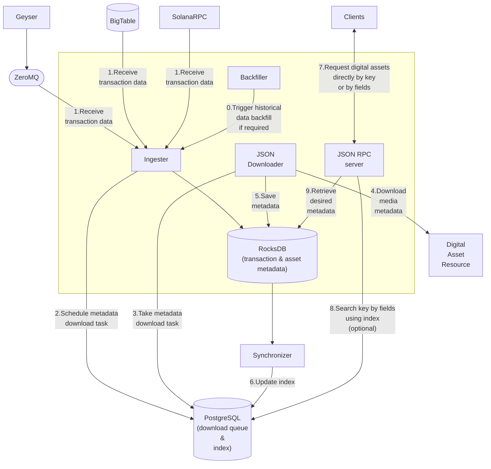

# General flow

The main flow of the application can be illustrated as following:

Data preparation part:

1. The **Ingester** mechanism continuously fetches fresh transactions Geyser that sends them via ZeroMQ (similar info can be also taken from Solana RPC nodes and Google BigTable).
2. The Ingester filters the newly fetched transactions (we are interested only in media related records), and saves them as task for downloading into the PostgreSQL db (we also use PostgreSQL as a queue).
3. After that, the JsonDownloader (interface::json::JsonDownloader) picks up a next tasks from the PostgreSQL "queue".
4. **JsonDownloader** fetches the media metadata from the source the actual media asset is persisted at.
5. The fetched metadata is saved to the RocksDB.
6. The **Synchronizer** (separate process) updates the index in PosgreSQL to make available searching by different matadata fields.

There is also the backfill mechanism that is used to load a historical data (metadata of already existing transactions).

Search data part:

7. A client (end user or another service) makes a call to our JSON RPC endpoint specifying field he wants to search by.
8. The server first goes to the PostgreSQL inxed to find an ID of the required record.
9. Using the ID, the server fetches required metadata from the RocksDB and returns to the client.

